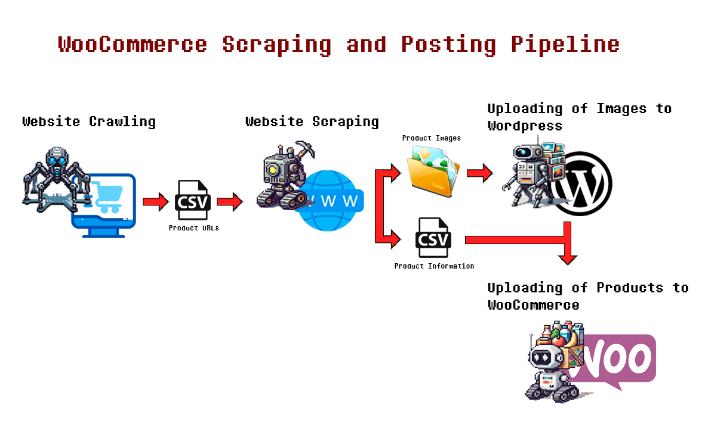

# WooCommerce Scraping and Posting Pipeline

This is a pipeline to "migrate" products from a website to a WooCommerce account (for dropshipping purposes) composed of four stages:

1. **Crawl a website** searching for products with a specific URL prefix, and save the URLs to a CSV.
2. **Scrape the product information and images** from the URLs stored in the CSV, and save them in a CSV and specific directories, respectively.
3. **Upload the images to the WordPress media directory.**
4. **Create the products in the WooCommerce account.**
<br><br/>

<p align="center">
  
</p>
<br><br/>
## To Implement This Project:

1. **Clone the project in the directory:**

   ```sh
   git clone https://github.com/DanielDialektico/woocommerce-scraping-posting.git
   cd woocommerce-ai-scrapping-posting

2. **Create a virtual environment and install the requirements:**
   ```sh
   python -m venv scrapost
   source scrapost/bin/activate   # On Windows use `scrapost\Scripts\activate`
   pip install -r requirements.txt

3. **Configure your credentials and URLs:**
   
   Open the config.py file in src/config/ and add your WooCommerce and WordPress credentials, and the URLs to crawl and scrape.
   ```sh
   # src/config/config.py

   CRAWL_URL = 'your_url_to_crawl'
   CATEGORIES_URL = 'reference_prefix_to_scrape'

   # Wordpress credentials.
   WP_URL = 'your_wordpress_url'
   WP_USERNAME = 'your_username'
   WP_PASSWORD = 'your_password'

   # Woocommerce credentials and configurations.
   WC_URL = 'your_woocommerce_url'
   WC_KEY = 'your_consumer_key'
   WC_SECRET = 'your_consumer_secret'
   WC_VERSION = 'wc/v3'
   WC_TIMEOUT = 20
   
4. **Run the pipeline stages:**

   Open the main.py in the root directory and check which of the 4 stages you want to execute. Comment the stages you don't need to run.
   ```sh
    # Run the website crawling pipeline to crawl product URLs.
    website_crawling_pipeline.run()
    
    # Run the website scraping pipeline to scrape data and images from the website
    website_scraping_pipeline.run()
    
    # Run the images upload pipeline to upload scraped images
    images_upload_pipeline.run()
    
    # Run the products uploading pipeline to create products in WooCommerce with the scraped data and images
    products_uploading_pipeline.run()

5. **Execute the script with:**

   Open the main.py in the root directory and check which of the 4 stages you want to execute. Uncomment the stages you don't need to run.
   ```sh
    python main.py

By following these steps, you can set up and run the pipeline to migrate products from a website to your WooCommerce account.

To personalize this pipeline, you need to adapt the code to your needs. Especially, the website scraping stage needs to target the specific selectors of the website you wish to scrape, these selectors are configurable in the BSScrapingService class in src/infrastructure/services/bs_scraping_service.py.